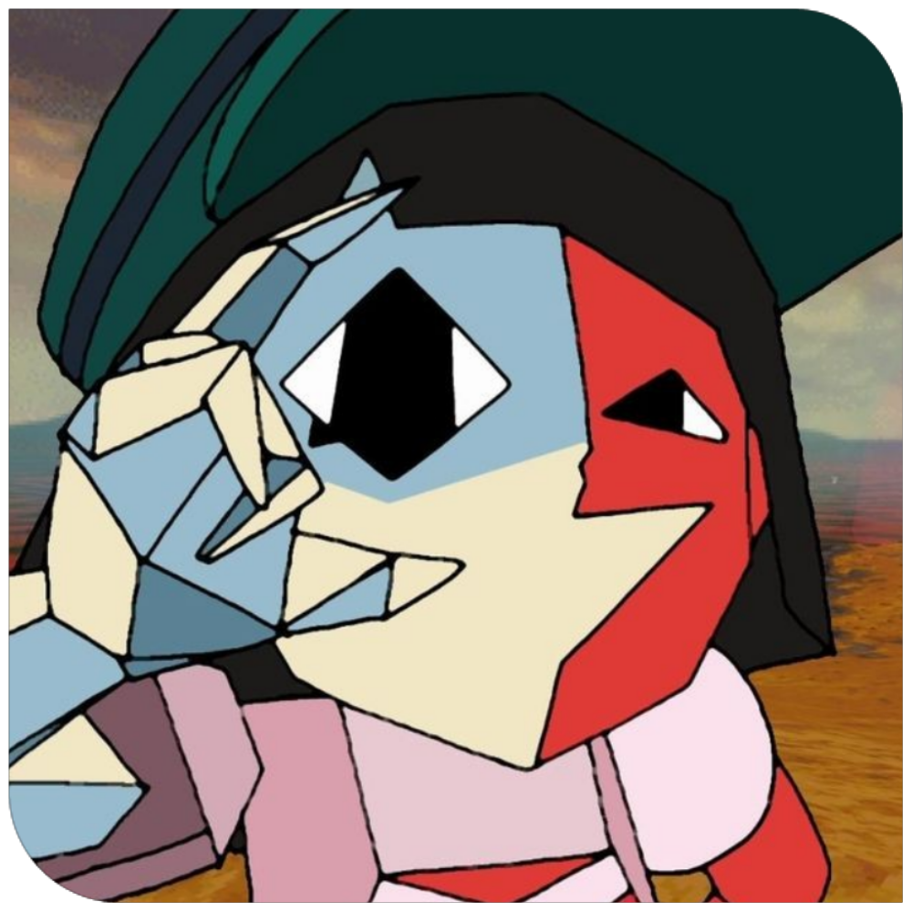
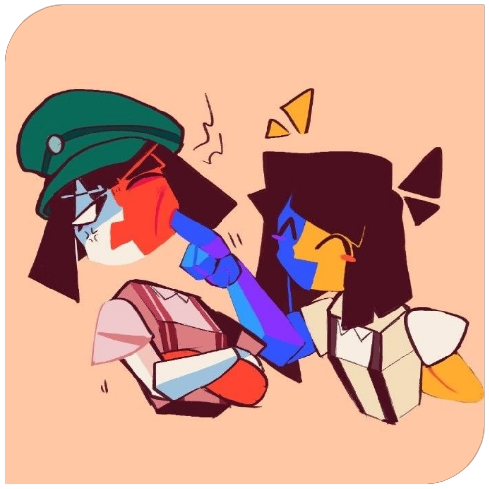
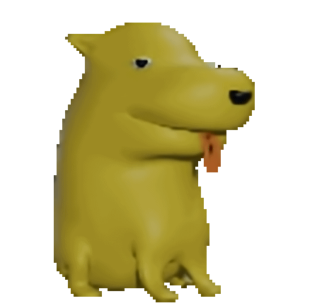
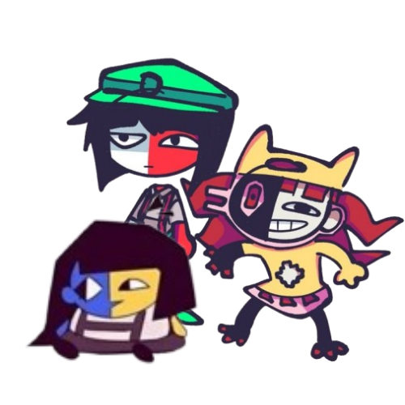

    

###

<section id="sobreMim">
    

        <h1>✨ Welcome, I'm Downzin! ✨</h1>
        
ありがとう

    

    
    

        👋🏼 Hi there! My name is <strong>Matheus Dantas</strong> 🤓, but online I'm known as <strong>Downzin</strong>. I create projects involving Discord bots, websites, and design. I'm passionate about learning and constantly exploring new technologies! <strong>(●'◡'●)</strong>  
    

    

        🧩 I'm deeply connected to art, anime, and games, and I'm active in several Discord communities—seeking not just social interaction, but also learning and business opportunities. 📚 I'm always improving my skills in audiovisual, design, web design, programming, and personal development to deliver top-notch entertainment with unmatched quality. <strong>(¬‿¬)</strong>
    

</section>

###

<section id="conhecimento">
    

        <h1>✨ Conhecimentos e Linguagens 💻</h1>
        
知識

    

     
    

        I’m currently enrolled in the Information Technology program at <a href="https://www.sp.senac.br/senac-americana">Senac - Americana</a> 📙, where I have the opportunity to enhance my skills in computer assembly and maintenance, network infrastructure, programming logic, and web development.
    

    

        In addition, I’ve been complementing my learning through courses offered by <a href="https://www.alura.com.br">Alura</a> 📗, a leading platform that has helped me improve my skills in programming and UI & UX. This journey began with creating Discord bots, and today I proudly share the knowledge I’ve gained along the way:
    

</section>

###

<section id='skills'>
    

        <h3>🚀 Languages, Technologies & Frameworks 💻</h3>
        

            
             
            
        

    

    

        <h3>✨ Software, Technologies & Platforms 💻</h3>
        

            
        

    

    

        <h3>✨ Databases 💻</h3>
        

            
        

    

    

        <h3>📚 Technologies, Languages & Software I Want to Learn 💻</h3>
        

            
             
            
             
        

    

</section>

###

<section id="status">
    

        <h1>📊 My Stats 📊</h1>
        

            
             
            
            
        

    

---
  

I am constantly seeking to improve my skills and expand my knowledge in the various technologies I’ve mentioned. The learning journey is ongoing, and I’m excited to explore new opportunities and challenges.😸

</section>

###

<section id="contato">
    

        <h1>💻 Contact</h1>
        
<blockquote>😀 If you have any suggestions, feedback, or want to collaborate on a project, I’d be happy to hear from you! 😁 I am constantly seeking to improve my skills and expand my knowledge in the various technologies I’ve mentioned. The learning journey is ongoing, and I’m excited to explore new opportunities and challenges. 😸</blockquote>

        

            
            
            
            
            
        

    

</section>

---

 

###

  
  

